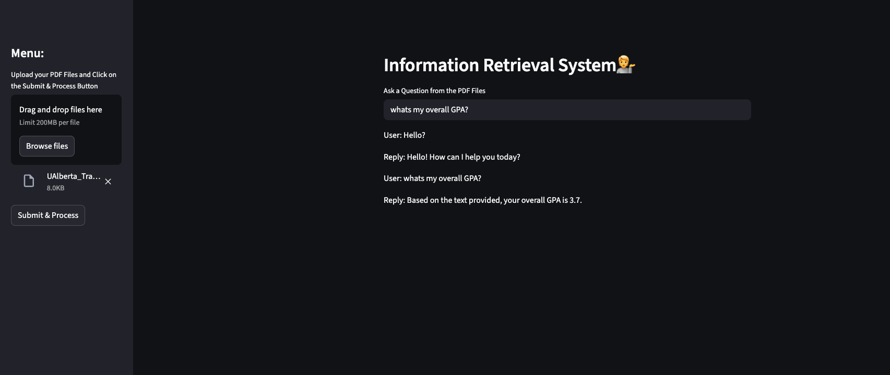

# 📄 PDF-Based Information Retrieval System (Gemini + Streamlit)



This is an interactive web application built with **Streamlit** that allows users to upload one or more PDF files and ask questions about their content using **Google's Gemini** large language model. It performs document chunking, semantic embedding, and conversational retrieval to give accurate answers based on the uploaded documents.

---

## 🚀 Features

- Upload multiple PDF files.
- Extract and chunk document text.
- Embed content using `GoogleGenerativeAIEmbeddings` (Gemini).
- Use a conversational interface powered by Gemini (`ChatGoogleGenerativeAI`).
- Memory-enabled Q&A for multi-turn conversations.

---

## 🛠️ Technologies Used

- Python 3.9
- Streamlit
- Langchain
- Google Generative AI (Gemini)
- FAISS (Vector Store)
- PyPDF2

---

## 📦 Setup Instructions

### 1. Clone the repository

```bash
git clone https://github.com/your-username/inf-retrieval-gemini.git
cd inf-retrieval-gemini
```

### 2. Create and activate a Conda environment (Python 3.9)

```bash
conda create -n genai python=3.9
conda activate genai
```

### 3. Install dependencies

```bash
pip install -r requirements.txt
```

### 4. Set your API key

```bash
GOOGLE_API_KEY=your_google_genai_api_key

```
You can get your API key from: https://makersuite.google.com/app/apikey

## ▶️ How to Run

```bash
streamlit run app.py
```

## 🖥️ How to Use

Open the web UI in your browser.

Upload one or more PDF files using the sidebar.

Click "Submit & Process" to extract, chunk, and embed the content.

Ask your questions in the input box and get responses powered by Gemini.


## 📜 License
MIT License. You are free to use, share, and adapt the code.
